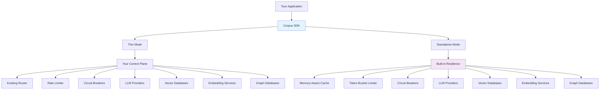
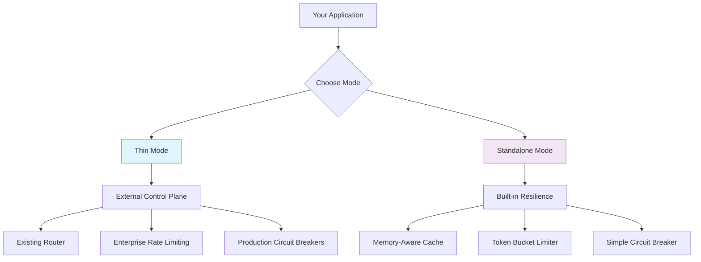
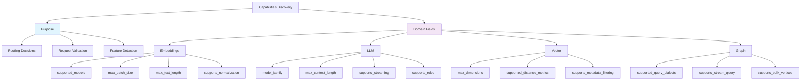
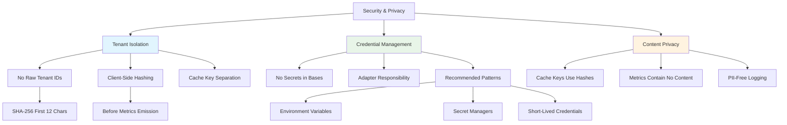
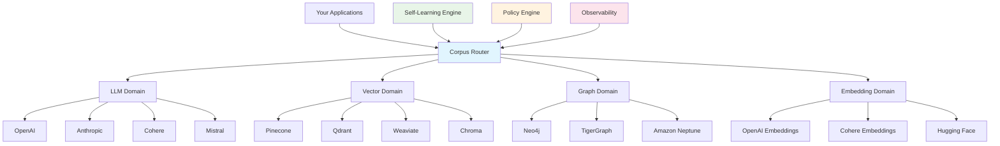
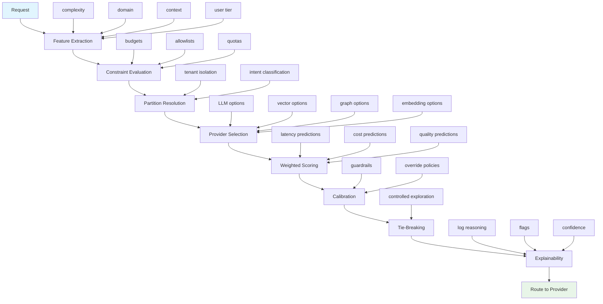

# Corpus SDK


Reference implementation of the **Corpus Protocol Suite** — a protocol-first, vendor-neutral SDK for interoperable AI/data backends: **LLM**, **Embedding**, **Vector**, and **Graph**.

Corpus defines stable, wire-level contracts (ops, envelopes, errors, capabilities) so that applications, routers, and providers can interoperate without bespoke glue code. This SDK implements those protocols for Python, with:

* Consistent error taxonomies
* Capability discovery
* SIEM-safe metrics
* Deadline & idempotency propagation
* Async-first, production-ready bases for adapters
* Canonical JSON envelopes and reserved `op` strings aligned with the public spec

Designed to compose cleanly under any external control plane (router, scheduler, rate limiter) while remaining usable in a lightweight **standalone** mode for development and simple services. Forming a complete foundation for AI infrastructure standardization across reasoning (LLM), relationships (Graph), semantic search (Vector), and text representation (Embedding) domains.

> **Open-Core Model**
>
> * The **Corpus Protocol Suite** and this **Corpus SDK** are **fully open source** (Apache-2.0).
> * **Corpus Router** and **official production adapters** are **commercial** offerings built *on top of* the same public protocols. They are optional; any compatible router/control plane can be used.
>
> Using Corpus SDK or implementing the Corpus Protocols does **not** lock you into Corpus Router. The protocols are vendor-neutral by design.

---

## 🏗️ Architecture at a Glance



---

## Table of Contents

1. [Why Corpus SDK](#why-corpus-sdk)
2. [How Corpus Compares](#how-corpus-compares)
3. [When Not to Use Corpus](#when-not-to-use-corpus)
4. [Features at a Glance](#features-at-a-glance)
5. [Performance vs Alternatives](#performance-vs-alternatives)
6. [Install](#install)
7. [⚡ 5-Minute Quick Start](#-5-minute-quick-start)
8. [Modes: `thin` vs `standalone`](#modes-thin-vs-standalone)
9. [Core Concepts](#core-concepts)
10. [Corpus-Compatible](#corpus-compatible)
11. [Quickstart](#quickstart)
    * [Embeddings](#embeddings-quickstart)
    * [LLM](#llm-quickstart)
    * [Vector](#vector-quickstart)
    * [Graph](#graph-quickstart)
12. [💼 Real-World Scenarios](#-real-world-scenarios)
13. [Error Taxonomy](#error-taxonomy)
14. [Metrics & Observability](#metrics--observability)
15. [Deadlines & Timeouts](#deadlines--timeouts)
16. [Caching](#caching)
17. [Rate Limiting & Circuit Breaking](#rate-limiting--circuit-breaking)
18. [Capabilities](#capabilities)
19. [Example Adapters](#example-adapters)
    * [Adapter Ecosystem](#adapter-ecosystem)
    * [Why Official Adapters Are Commercial](#why-official-adapters-are-commercial)
20. [Security & Privacy](#security--privacy)
21. [Performance Notes](#performance-notes)
22. [🏎️ Performance Benchmarks](#️-performance-benchmarks)
23. [Versioning & Compatibility](#versioning--compatibility)
24. [Testing](#testing)
25. [Troubleshooting](#troubleshooting)
26. [🚚 Migration Examples](#-migration-examples)
27. [FAQ](#faq)
28. [Contributing](#contributing)
29. [License](#license)
30. [Roadmap](#roadmap)
31. [Appendix](#appendix)
32. [Commercial Options](#commercial-options)
33. [Corpus Router: Enterprise AI Infrastructure Orchestration](#corpus-router-enterprise-ai-infrastructure-orchestration)
34. [Final Assessment & Launch Readiness](#final-assessment--launch-readiness)

---

## Why Corpus SDK

Modern AI platforms juggle multiple LLM, embedding, vector, and graph backends. Each vendor has unique APIs, error schemes, rate limits, and capabilities — making cross-provider integration brittle and costly.

**The Core Problem: AI Infrastructure Chaos**

1. **Provider Proliferation**: Dozens of LLM providers, vector databases, and graph databases with incompatible APIs
2. **Duplicate Integration**: Enterprises rewriting the same error handling, observability, and resilience patterns for each provider
3. **Vendor Lock-in**: Applications tightly coupled to specific AI infrastructure choices
4. **Operational Complexity**: Inconsistent monitoring, logging, and error handling across AI services

**Corpus SDK provides:**

* **Stable, runtime-checkable protocols** across domains
* **Normalized errors** with retry hints and scopes
* **SIEM-safe metrics** (low-cardinality; tenant hashed)
* **Deadline propagation** for cancellation & cost control
* **Two modes**: compose under your own router (**thin**) or use lightweight infra (**standalone**)

---

## How Corpus Compares

| Aspect | LangChain/LlamaIndex | OpenRouter | MCP | **Corpus SDK** |
|--------|---------------------|------------|-----|----------------|
| **Scope** | Application framework | LLM unification | Tools & data sources | **AI infrastructure protocols** |
| **Domains Covered** | LLM + Tools | LLM only | Tools + Data | **LLM + Vector + Graph + Embedding** |
| **Error Standardization** | Partial | Limited | N/A | **Comprehensive taxonomy** |
| **Multi-Provider Routing** | Basic | Managed service | N/A | **Protocol for any router** |
| **Observability** | Basic | Limited | N/A | **Built-in metrics + tracing** |
| **Installation** | Heavy dependencies | Service API | Early stage | **Lightweight, async-first** |
| **Vendor Neutrality** | High | Service-dependent | High | **Protocol-first, no lock-in** |

**When to use each:**
- **LangChain/LlamaIndex**: Building complex AI applications with tool orchestration
- **OpenRouter**: Quick LLM unification without infrastructure changes  
- **MCP**: Standardizing tools and data sources for AI applications
- **Corpus SDK**: Standardizing entire AI infrastructure stack with production observability

### **Unified Integration: All Three as Corpus Adapters**

The key advantage of Corpus's protocol-first approach is that **LangChain, OpenRouter, and MCP can all be integrated as adapters within the Corpus ecosystem**:

```python
# LangChain as a Corpus LLM adapter
class LangChainLLMAdapter(BaseLLMAdapter):
    async def _do_complete(self, messages, **kwargs):
        # Wrap LangChain LLM with Corpus standardization
        llm = ChatOpenAI(model=kwargs["model"])
        result = await llm.ainvoke(messages)
        return self._normalize_langchain_result(result)

# OpenRouter as a Corpus LLM adapter  
class OpenRouterAdapter(BaseLLMAdapter):
    async def _do_complete(self, messages, **kwargs):
        # Standardize OpenRouter API with Corpus error handling
        response = await self._call_openrouter(messages, kwargs["model"])
        return self._normalize_openrouter_result(response)

# MCP as a Corpus Tools adapter
class MCPToolsAdapter(BaseLLMAdapter):
    async def _do_complete(self, messages, **kwargs):
        # Use MCP servers as tools within Corpus LLM flow
        mcp_tools = await self._get_mcp_tools()
        return await self._complete_with_tools(messages, mcp_tools)
```

**Benefits of this approach:**
- **Standardized observability**: All adapters emit the same metrics and error taxonomy
- **Consistent routing**: Mix and match providers, frameworks, and protocols under one routing layer
- **Production reliability**: All integrations inherit Corpus's deadline propagation, retry logic, and circuit breaking
- **Vendor neutrality**: Switch between LangChain, OpenRouter, or direct providers without changing application code

**Instead of choosing one framework, use Corpus as the unifying layer that standardizes them all.**

---

## When Not to Use Corpus

You probably don't need corpus_sdk or Corpus Router if:

1. **You're single-provider and happy**: One LLM/vector/graph backend, and you're fine with their SDKs and breaking changes.
2. **No governance/compliance pressure**: No per-tenant isolation, budgets, audit trails, or data residency constraints.
3. **No cross-domain orchestration**: You're not coordinating LLM + Vector + Graph + Embedding as a unified substrate.
4. **You want infra logic in-app**: You prefer to hard-code routing, retries, backoff, and failover directly.
5. **It's a quick throwaway prototype**: Lock-in, metrics, and resilience aren't worth thinking about (yet).

If any of these stop being true, corpus_sdk is the incremental next step; Corpus Router becomes relevant once you need centralized, explainable, multi-provider routing.

---

## Features at a Glance

* **Async-first, production-hardened** bases that validate inputs and instrument operations
* **Capability discovery** to guide routing/planning
* **Strict error taxonomy** per domain (Embedding/LLM/Vector/Graph)
* **Metrics hooks** that never leak PII (tenant hashing)
* **Optional in-memory cache** (Embedding + LLM complete), rate limiter, and simple circuit breaker in **standalone** mode
* **Wire-first protocol design** with canonical JSON envelopes for transport-agnostic interoperability
* **Canonical `op` registry** aligned with the Corpus Protocol Suite for consistent routing and interoperability
* **Lifecycle management** with async context manager support for clean resource cleanup
* **Everything ships in single files per domain** (protocols + base) to keep adoption friction low

---

## Performance vs Alternatives

| Metric | Native SDKs | Generic Proxy | **Corpus SDK** |
|--------|-------------|---------------|----------------|
| **Routing Overhead** | N/A | 100-500ms | **<10ms** |
| **Error Consistency** | Per-vendor | Partial | **100%** |
| **Observability Setup** | Per-vendor | Manual | **Built-in** |
| **Multi-Provider Switch Time** | Weeks | Days | **Minutes** |
| **Cost Visibility** | None | Partial | **Real-time** |
| **Cross-Domain Standardization** | None | Partial | **Complete** |

*Benchmarks from internal testing. Your results may vary.*

---

## Install

```bash
pip install corpus_sdk
```

* Python ≥ 3.9 recommended
* No heavy runtime dependencies; bring your own metrics sink or use the provided `NoopMetrics`

---

## ⚡ 5-Minute Quick Start

```python
# Simplest possible working example - get started in under 5 minutes
from corpus_sdk.llm_base import BaseLLMAdapter, OperationContext

class QuickAdapter(BaseLLMAdapter):
    async def _do_complete(self, messages, **kwargs):
        return {"text": "Hello from Corpus!", "model": "quick-demo"}

# Use it immediately
adapter = QuickAdapter()
ctx = OperationContext(request_id="test-123")
result = await adapter.complete(messages=[{"role": "user", "content": "Hi"}], ctx=ctx)
print(result.text)  # "Hello from Corpus!"
```

---

## Modes: `thin` vs `standalone`



Corpus SDK can operate in two mutually exclusive modes:

### **`thin` (default)**

All infra hooks are **no-ops**. Use this when you already have a control plane (router/scheduler/limiter/caching/circuit breaker). Prevents **double-stacking** resiliency.

### **`standalone`**

Enables a small set of helpers:

* Deadline enforcement
* Simple circuit breaker
* Tiny token-bucket limiter
* In-memory TTL cache (for deterministic, safe ops)

Ideal for demos, dev, and light workloads.

> If you run in **standalone** without a metrics sink, the SDK will emit a warning advising you to provide one before production use.

---

## Core Concepts

### Protocol vs Base

* **Protocol**: A runtime-checkable interface (e.g., `EmbeddingProtocolV1`) that defines *what* an adapter must implement.
* **Base**: A concrete class (e.g., `BaseEmbeddingAdapter`) that implements validation, deadlines, metrics, caching (where safe), and error normalization. You implement the `_do_*` hooks to talk to your provider.

### OperationContext

A small struct propagated across operations:

* `request_id`, `idempotency_key`, `deadline_ms`, `traceparent`, `tenant`, `attrs`
* Never logged raw; tenants are hashed before recording to metrics

### Capabilities

Each domain exposes a `*Capabilities` object (e.g., `LLMCapabilities`) that describes supported features, limits (context length, batch size), and flags such as `supports_deadline`, `supports_streaming`, etc.

### Wire Protocol

All protocols support canonical JSON envelopes for transport-agnostic interoperability, aligned with the Corpus Protocol Suite:

**Request:**

```json
{
  "op": "<protocol>.<operation>",
  "ctx": {
    "request_id": "...",
    "idempotency_key": "...",
    "deadline_ms": 1234567890,
    "traceparent": "...",
    "tenant": "...",
    "attrs": {}
  },
  "args": {}
}
```

**Success:**

```json
{
  "ok": true,
  "code": "OK",
  "ms": 123.45,
  "result": {}
}
```

**Error:**

```json
{
  "ok": false,
  "code": "RESOURCE_EXHAUSTED",
  "error": "ResourceExhausted",
  "message": "Rate limit exceeded",
  "retry_after_ms": 5000,
  "details": {},
  "ms": 45.67
}
```

The reserved `op` strings and envelope shapes are defined in the spec and implemented here.

---

## Corpus-Compatible

An implementation (SDK, router, or adapter) MAY claim to be **Corpus-Compatible** if it:

1. Implements the canonical wire envelopes (`op`, `ctx`, `args`) and response shapes from the Corpus Protocol Suite.
2. Honors the reserved `op` strings (e.g., `llm.complete`, `embedding.embed_batch`, `vector.query`, `graph.query`) without changing their semantics.
3. Maps provider-specific errors into the normalized error taxonomy defined by the spec.
4. Preserves streaming semantics (exactly one terminal frame; no `data` after `end`/`error`) where applicable.

We **encourage** forks and independent implementations that remain wire-compatible. Forking while staying compatible strengthens the ecosystem and builds on the same shared standard.

> Note: Names like "Corpus", "Corpus Protocol", and "Corpus-Compatible" may be protected marks. You are free to implement the protocols under Apache-2.0, but SHOULD NOT market incompatible variants as "Corpus Protocol" or "Corpus-Compatible".

---

## Quickstart Examples

> **Note**: In all examples, swap `Example*Adapter` with your actual adapter class that inherits the corresponding base and implements `_do_*` hooks.

### Embeddings Quickstart

```python
from corpus_sdk.adapter_sdk.embedding_base import (
    BaseEmbeddingAdapter, EmbedSpec, OperationContext, EmbeddingVector,
    EmbeddingCapabilities, BatchEmbedSpec, BatchEmbedResult, EmbedResult
)

class ExampleEmbeddingAdapter(BaseEmbeddingAdapter):
    async def _do_capabilities(self) -> EmbeddingCapabilities:
        return EmbeddingCapabilities(
            server="example-embeddings",
            version="1.0.0",
            supported_models=("example-embed-001",),
            max_batch_size=128,
            max_text_length=8192,
            supports_normalization=True,
            normalizes_at_source=False,
            supports_deadline=True,
            supports_token_counting=False
        )

    async def _do_embed(self, spec: EmbedSpec, *, ctx: OperationContext | None) -> EmbedResult:
        vec = [0.1, 0.2, 0.3]
        return EmbedResult(
            embedding=EmbeddingVector(
                vector=vec,
                text=spec.text,
                model=spec.model,
                dimensions=len(vec)
            ),
            model=spec.model,
            text=spec.text,
            tokens_used=None,
            truncated=False
        )

    async def _do_embed_batch(self, spec: BatchEmbedSpec, *, ctx: OperationContext | None) -> BatchEmbedResult:
        vecs = [[0.1, 0.2, 0.3] for _ in spec.texts]
        return BatchEmbedResult(
            embeddings=[
                EmbeddingVector(
                    vector=v,
                    text=t,
                    model=spec.model,
                    dimensions=len(v)
                )
                for v, t in zip(vecs, spec.texts)
            ],
            model=spec.model,
            total_texts=len(spec.texts),
            total_tokens=None,
            failed_texts=[]
        )

    async def _do_count_tokens(
        self,
        text: str,
        model: str,
        *,
        ctx: OperationContext | None
    ) -> int:
        return len(text.split())

    async def _do_health(self, *, ctx: OperationContext | None) -> dict:
        return {
            "ok": True,
            "server": "example-embeddings",
            "version": "1.0.0",
            "models": {"example-embed-001": "ok"}
        }

# Usage with lifecycle management
async with ExampleEmbeddingAdapter() as adapter:
    ctx = OperationContext(request_id="req-1", tenant="acme")
    res = await adapter.embed(
        EmbedSpec(text="hello world", model="example-embed-001"),
        ctx=ctx
    )
    print(res.embedding.vector)
# Adapter automatically cleaned up
```

### LLM Quickstart

```python
from corpus_sdk.adapter_sdk.llm_base import (
    BaseLLMAdapter, OperationContext, LLMCompletion,
    TokenUsage, LLMCapabilities, LLMChunk, LLMStreamResult
)

class ExampleLLMAdapter(BaseLLMAdapter):
    async def _do_capabilities(self) -> LLMCapabilities:
        return LLMCapabilities(
            server="example-llm",
            version="1.0.0",
            model_family="gpt-4",
            max_context_length=8192,
            supports_streaming=True,
            supports_roles=True,
            supports_json_output=False,
            supports_parallel_tool_calls=False,
            idempotent_writes=False,
            supports_multi_tenant=True,
            supports_system_message=True,
        )

    async def _do_complete(self, messages, model, **kwargs) -> LLMCompletion:
        usage = TokenUsage(
            prompt_tokens=5,
            completion_tokens=5,
            total_tokens=10
        )
        return LLMCompletion(
            text="Hello from example-llm!",
            model=model,
            model_family="gpt-4",
            usage=usage,
            finish_reason="stop"
        )

    async def _do_stream(self, messages, model, **kwargs) -> LLMStreamResult:
        async def generate_chunks():
            yield LLMChunk(text="Hello ", is_final=False)
            yield LLMChunk(text="world!", is_final=True)
        
        return LLMStreamResult(chunks=generate_chunks())

    async def _do_count_tokens(
        self,
        text: str,
        *,
        model: str | None,
        ctx: OperationContext | None
    ) -> int:
        return len(text.split())

    async def _do_health(self, *, ctx: OperationContext | None) -> dict:
        return {
            "ok": True,
            "server": "example-llm",
            "version": "1.0.0"
        }

# Usage with lifecycle management
async with ExampleLLMAdapter() as adapter:
    ctx = OperationContext(request_id="req-2", tenant="acme")
    resp = await adapter.complete(
        messages=[{"role": "user", "content": "Say hi"}],
        model="example-llm-001",
        ctx=ctx
    )
    print(resp.text)
# Adapter automatically cleaned up
```

### Vector Quickstart

```python
from corpus_sdk.adapter_sdk.vector_base import (
    BaseVectorAdapter, VectorCapabilities, QuerySpec, QueryResult,
    Vector, VectorMatch, UpsertSpec, UpsertResult, DeleteSpec,
    DeleteResult, NamespaceSpec, NamespaceResult, OperationContext, VectorID
)

class ExampleVectorAdapter(BaseVectorAdapter):
    async def _do_capabilities(self) -> VectorCapabilities:
        return VectorCapabilities(
            server="example-vector",
            version="1.0.0",
            max_dimensions=3
        )

    async def _do_query(
        self,
        spec: QuerySpec,
        *,
        ctx: OperationContext | None
    ) -> QueryResult:
        v = Vector(
            id=VectorID("v1"),
            vector=[0.1, 0.2, 0.3],
            metadata={"label": "demo"},
            namespace=spec.namespace
        )
        return QueryResult(
            matches=[VectorMatch(vector=v, score=0.99, distance=0.01)],
            query_vector=spec.vector,
            namespace=spec.namespace,
            total_matches=1
        )

    async def _do_upsert(
        self,
        spec: UpsertSpec,
        *,
        ctx: OperationContext | None
    ) -> UpsertResult:
        return UpsertResult(
            upserted_count=len(spec.vectors),
            failed_count=0,
            failures=[]
        )

    async def _do_delete(
        self,
        spec: DeleteSpec,
        *,
        ctx: OperationContext | None
    ) -> DeleteResult:
        return DeleteResult(
            deleted_count=len(spec.ids),
            failed_count=0,
            failures=[]
        )

    async def _do_create_namespace(
        self,
        spec: NamespaceSpec,
        *,
        ctx: OperationContext | None
    ) -> NamespaceResult:
        return NamespaceResult(
            success=True,
            namespace=spec.namespace,
            details={"created": True}
        )

    async def _do_delete_namespace(
        self,
        namespace: str,
        *,
        ctx: OperationContext | None
    ) -> NamespaceResult:
        return NamespaceResult(
            success=True,
            namespace=namespace,
            details={"deleted": True}
        )

    async def _do_health(self, *, ctx: OperationContext | None) -> dict:
        return {
            "ok": True,
            "server": "example-vector",
            "version": "1.0.0",
            "namespaces": {"default": "ok"}
        }

# Usage
adapter = ExampleVectorAdapter()
ctx = OperationContext(request_id="req-3", tenant="acme")

result = await adapter.query(
    QuerySpec(vector=[0.1, 0.2, 0.3], top_k=1),
    ctx=ctx
)
print(result.matches[0].score)
```

### Graph Quickstart

```python
from corpus_sdk.adapter_sdk.graph_base import (
    BaseGraphAdapter, GraphCapabilities, GraphQuerySpec,
    UpsertNodesSpec, UpsertEdgesSpec, Node, Edge, GraphID,
    OperationContext, GraphQueryResult, UpsertNodesResult,
    UpsertEdgesResult, DeleteNodesResult, DeleteEdgesResult,
    BulkVerticesResult, BatchResult, SchemaResult
)

class ExampleGraphAdapter(BaseGraphAdapter):
    async def _do_capabilities(self) -> GraphCapabilities:
        return GraphCapabilities(
            server="example-graph",
            version="1.0.0",
            supported_query_dialects=("cypher",),
            supports_stream_query=True,
            supports_bulk_vertices=True,
            supports_batch=True,
            supports_schema=True
        )

    async def _do_query(
        self,
        spec: GraphQuerySpec,
        *,
        ctx: OperationContext | None
    ) -> GraphQueryResult:
        return GraphQueryResult(
            records=[{"id": 1, "name": "Ada"}],
            summary={"rows": 1},
            dialect=spec.dialect,
            namespace=spec.namespace
        )

    async def _do_stream_query(
        self,
        spec: GraphQuerySpec,
        *,
        ctx: OperationContext | None
    ):
        yield GraphQueryResult(records=[{"id": 1}], is_final=False)
        yield GraphQueryResult(records=[{"id": 2}], is_final=True, summary={"rows": 2})

    async def _do_upsert_nodes(
        self,
        spec: UpsertNodesSpec,
        *,
        ctx: OperationContext | None
    ) -> UpsertNodesResult:
        return UpsertNodesResult(
            upserted_count=len(spec.nodes),
            failed_count=0,
            failures=[]
        )

    async def _do_upsert_edges(
        self,
        spec: UpsertEdgesSpec,
        *,
        ctx: OperationContext | None
    ) -> UpsertEdgesResult:
        return UpsertEdgesResult(
            upserted_count=len(spec.edges),
            failed_count=0,
            failures=[]
        )

    async def _do_delete_nodes(
        self, 
        ids: list[GraphID], 
        *, 
        ctx: OperationContext | None
    ) -> DeleteNodesResult:
        return DeleteNodesResult(
            deleted_count=len(ids),
            failed_count=0,
            failures=[]
        )

    async def _do_delete_edges(
        self, 
        ids: list[GraphID], 
        *, 
        ctx: OperationContext | None
    ) -> DeleteEdgesResult:
        return DeleteEdgesResult(
            deleted_count=len(ids),
            failed_count=0,
            failures=[]
        )

    async def _do_bulk_vertices(
        self, 
        cursor: str | None, 
        limit: int, 
        *, 
        ctx: OperationContext | None
    ) -> BulkVerticesResult:
        return BulkVerticesResult(
            nodes=[],
            next_cursor=None,
            has_more=False
        )

    async def _do_batch(
        self, 
        ops: list, 
        *, 
        ctx: OperationContext | None
    ) -> BatchResult:
        return BatchResult(results=[{"ok": True} for _ in ops])

    async def _do_get_schema(self, *, ctx: OperationContext | None) -> SchemaResult:
        return SchemaResult(
            nodes={"User": {"properties": {}}},
            edges={"FOLLOWS": {}},
            metadata={"version": "1.0"}
        )

    async def _do_health(self, *, ctx: OperationContext | None) -> dict:
        return {
            "ok": True,
            "server": "example-graph",
            "version": "1.0.0"
        }

# Usage with lifecycle management
async with ExampleGraphAdapter() as adapter:
    ctx = OperationContext(request_id="req-4", tenant="acme")

    # Create nodes
    result = await adapter.upsert_nodes(
        UpsertNodesSpec(nodes=[
            Node(
                id=GraphID("user:1"),
                labels=("User",),
                properties={"name": "Ada"}
            )
        ]),
        ctx=ctx
    )
    print(f"Upserted {result.upserted_count} nodes")
# Adapter automatically cleaned up
```

---

## 💼 Real-World Scenarios

### **Multi-Cloud AI Strategy**
```python
# Route between providers based on cost, latency, and quality requirements
strategies = {
    "cost_optimized": [("anthropic", 0.6), ("openai", 0.3), ("cohere", 0.1)],
    "low_latency": [("openai", 0.8), ("cohere", 0.2)],
    "high_quality": [("openai-gpt4", 1.0)]
}

# Corpus Router automatically handles fallbacks and load balancing
```

### **Enterprise Multi-Tenant Isolation**
```python
# Each tenant gets isolated circuit breakers, rate limits, and caches
await router.route_workflow({
    "workflow_type": "rag_pipeline", 
    "tenant_id": "enterprise_customer_123",
    "priority": 8,  # Higher priority tenants get better QoS
    "budget_ceiling": 1000  # Monthly budget in dollars
})
```

### **Airtable-Style Workflow Automation**
```python
# Connect AI workflows to business data with consistent error handling
import asyncio
from corpus_sdk.llm_base import BaseLLMAdapter, OperationContext

class AirtableCorpusAdapter:
    def __init__(self, corpus_llm: BaseLLMAdapter, airtable_base):
        self.llm = corpus_llm
        self.airtable = airtable_base
    
    async def process_records(self, table_name: str, batch_size: int = 10):
        """Process Airtable records with standardized AI operations"""
        records = await self.airtable.get_records(table_name, batch_size=batch_size)
        
        for record in records:
            try:
                # Standardized AI operations across your entire stack
                summary = await self.llm.complete(
                    messages=[{"role": "user", "content": f"Summarize: {record['description']}"}],
                    ctx=OperationContext(
                        tenant_id=record['team_id'],
                        request_id=f"airtable_{record['id']}"
                    )
                )
                
                # Update Airtable with results
                await self.airtable.update_record(
                    table_name, 
                    record['id'], 
                    {"summary": summary.text, "processed_at": "2024-01-01"}
                )
                
            except ResourceExhausted as e:
                # Consistent error handling across all AI providers
                logger.warning(f"Rate limited, retrying in {e.retry_after_ms}ms")
                await asyncio.sleep(e.retry_after_ms / 1000)
                continue
                
            except Exception as e:
                logger.error(f"Failed to process record {record['id']}: {e}")
                continue

# Usage
adapter = AirtableCorpusAdapter(corpus_llm_adapter, airtable_base)
await adapter.process_records("customer_feedback", batch_size=25)
```

### **Regulated Industry Compliance**
```python
# Healthcare: HIPAA-compliant tenant isolation with audit trails
await corpus_router.route_workflow({
    "workflow_type": "medical_summarization",
    "tenant_id": "hospital_alpha",  # Fully isolated circuit breakers
    "parameters": {
        "compliance_level": "hipaa",
        "data_retention_days": 30
    }
})
```

### **E-commerce Personalization**
```python
# Multi-provider AI for personalized recommendations
async def generate_product_recommendations(user_id: str, product_catalog: list):
    # Vector search for similar products
    user_embedding = await embedding_adapter.embed(
        EmbedSpec(text=user_profile, model="text-embedding-ada-002")
    )
    
    similar_products = await vector_adapter.query(
        QuerySpec(
            vector=user_embedding.vector,
            top_k=10,
            namespace="products",
            filter={"category": {"$in": user_preferences}}
        )
    )
    
    # LLM for personalized descriptions
    personalized_descriptions = await llm_adapter.complete(
        messages=[{
            "role": "user", 
            "content": f"Create personalized descriptions for: {similar_products}"
        }],
        ctx=OperationContext(tenant_id=user_id)
    )
    
    return personalized_descriptions
```

---

## Error Taxonomy

All domains use normalized, structured exceptions with optional guidance fields:

**Common Errors:**

* `BadRequest` - Invalid request parameters or malformed input
* `AuthError` - Authentication or authorization failure
* `ResourceExhausted` - Quota, rate limit, or capacity exceeded
* `TransientNetwork` - Retryable network failure
* `Unavailable` - Service temporarily unavailable or overloaded
* `NotSupported` - Unsupported feature or parameter
* `DeadlineExceeded` - Operation exceeded `ctx.deadline_ms`

**Domain-Specific Errors:**

* Embedding: `TextTooLong`, `ModelNotFound`
* LLM: `ModelOverloaded`
* Vector: `DimensionMismatch`, `IndexNotReady`
* Graph: (Uses common errors with domain-specific details)

**Optional Guidance Fields:**

* `retry_after_ms` - Suggested backoff delay
* `throttle_scope` / `resource_scope` - Scope of limitation
* `suggested_*_reduction` - Guidance for quota errors
* `details` - Additional context (JSON-serializable)

This enables consistent handling (e.g., retry budgets, UI messaging) regardless of provider.

---

## Metrics & Observability

### MetricsSink Protocol

```python
class MetricsSink(Protocol):
    def observe(
        self,
        *,
        component: str,  # "llm", "embedding", "vector", "graph"
        op: str,         # "complete", "embed", "query", etc.
        ms: float,       # Latency in milliseconds
        ok: bool,        # Success/failure
        code: str,       # "OK" or error class name
        extra: Optional[Mapping[str, Any]] = None
    ) -> None: ...
    
    def counter(
        self,
        *,
        component: str,
        name: str,
        value: int = 1,
        extra: Optional[Mapping[str, Any]] = None
    ) -> None: ...
```

### Privacy & Cardinality

* **Low cardinality only** - No PII in metrics
* **Tenant hashing** - Tenants are SHA-256 hashed (first 12 chars) before emission
* **Per-operation timing** - Bases record timing and outcome for all operations
* **Token counters** - LLM/Embedding bases emit token usage counters

---

## Deadlines & Timeouts

### How Deadlines Work

* All bases accept `OperationContext.deadline_ms` (absolute epoch milliseconds)
* **Thin mode**: Deadlines pass through to backend (no enforcement)
* **Standalone mode**: Enforced via `SimpleDeadline` policy using `asyncio.wait_for`

### Deadline Behavior by Operation

* **Unary operations** (complete, embed, query): Single deadline check
* **Streaming operations** (stream, stream_query): Periodic checks during iteration
* **Batch operations**: Single check for entire batch

### Timeout Mapping

* `asyncio.TimeoutError` → `DeadlineExceeded`
* Network timeouts → `TransientNetwork` or `Unavailable`
* Backend timeouts → Domain-specific error with `details={"kind": "timeout"}`

---

## Caching

### What Gets Cached

* **Embeddings**: `embed()` results (deterministic based on text + model + normalization)
* **LLM**: `complete()` results only (not `stream()`)
* **Vector/Graph**: No base-level caching (typically handled by backend or router)

### Cache Key Construction

**Embeddings:**

```python
key = f"embed:{model}:{normalize}:{sha256(text)}"
```

**LLM:**

```python
key = (
    f"llm:complete:{model}:{sha256(system)}:{sha256(messages)}:"
    f"{temperature}:{top_p}:{freq_pen}:{pres_pen}:{max_tokens}:"
    f"{sha256(stop_sequences)}:{tenant_hash}"
)
```

### Cache Behavior

* **Thin mode**: Cache is no-op
* **Standalone mode**: In-memory TTL cache with opportunistic pruning
* **TTL**: Configurable (default 60s for LLM, 300s for Embedding)
* **Tenant isolation**: Cache keys include tenant hash to prevent cross-tenant leaks

---

## Rate Limiting & Circuit Breaking

### Pluggable Policies

Minimal interfaces allow enterprise infrastructure integration:

```python
class RateLimiter(Protocol):
    async def acquire(self) -> None: ...
    def release(self) -> None: ...

class CircuitBreaker(Protocol):
    def allow(self) -> bool: ...
    def on_success(self) -> None: ...
    def on_error(self, err: Exception) -> None: ...
```

### Built-in Implementations

**Thin mode:**

* `NoopLimiter` - Pass-through
* `NoopBreaker` - Always allows

**Standalone mode:**

* `TokenBucketLimiter` - Simple per-process token bucket
* `SimpleCircuitBreaker` - Counter-based breaker with half-open recovery

> **Production note**: Use thin mode with enterprise rate limiting and circuit breaking infrastructure (e.g., Envoy, AWS API Gateway, Corpus Router).

---

## Capabilities



### Purpose

Capabilities enable:

* **Routing decisions** - Select appropriate provider/model
* **Request validation** - Preflight checks before backend calls
* **Feature detection** - Runtime discovery of supported operations

### Capability Fields by Domain

**Embeddings:**

* `supported_models`, `max_batch_size`, `max_text_length`
* `supports_normalization`, `normalizes_at_source`
* `supports_token_counting`, `supports_deadline`

**LLM:**

* `model_family`, `max_context_length`, `supported_models`
* `supports_streaming`, `supports_roles`, `supports_system_message`
* `supports_json_output`, `supports_parallel_tool_calls`
* `supports_deadline`, `supports_count_tokens`

**Vector:**

* `max_dimensions`, `supported_distance_metrics`
* `supports_metadata_filtering`, `supports_namespaces`
* `max_batch_size`, `supports_deadline`

**Graph:**

* `supported_query_dialects` - e.g., `("cypher", "gremlin", "gql")`
* `supports_stream_query`, `supports_bulk_vertices`, `supports_batch`
* `supports_schema`, `supports_namespaces`, `supports_deadline`

---

## Example Adapters

### Repository Structure

```text
corpus_sdk/
├── adapter_sdk/
│   ├── embedding_base.py      # Protocol + Base
│   ├── llm_base.py            # Protocol + Base
│   ├── vector_base.py         # Protocol + Base
│   └── graph_base.py          # Protocol + Base
└── examples/
    ├── openai_adapter.py       # Example (reference only)
    ├── anthropic_adapter.py    # Example (reference only)
    └── pinecone_adapter.py     # Example (reference only)
```

### Adapter Ecosystem

* **Example adapters** (in repo): Illustration and testing only
* **Official adapters** (commercial): Production-hardened, maintained by Corpus team
* **Community adapters**: Built by ecosystem partners and users — we actively encourage community-maintained, Corpus-Compatible adapters and are happy to highlight stable ones.

### Why Official Adapters Are Commercial

Official adapters include:

* **Provider-specific optimizations** - Batching strategies, retry logic tuned per provider
* **Advanced error mapping** - Vendor-specific → normalized with operational guidance
* **Health check integration** - Deep provider health status monitoring
* **Support & SLAs** - Guaranteed response times and bug fixes
* **Certification** - Tested against provider SLA requirements
* **Continuous updates** - Maintained as providers evolve their APIs

**Available with:**

* Corpus Router subscriptions (managed or on-prem)
* Standalone official adapter licenses

---

## Security & Privacy



### Tenant Isolation

* **No raw tenant IDs in logs/metrics** - All tenant IDs hashed client-side (SHA-256, first 12 chars)
* **Cache key separation** - Tenant hash included in cache keys
* **Multi-tenant support** - Via `OperationContext.tenant` and namespace fields

### Credential Management

* **No secrets in bases** - Adapters accept credentials via constructor or environment
* **Adapter responsibility** - Backend authentication handled by adapter implementations
* **Recommended patterns**:

  * Environment variables for local dev
  * Secret managers (AWS Secrets Manager, HashiCorp Vault) for production
  * Short-lived credentials with automatic rotation

### Content Privacy

* **Cache keys use hashes** - Actual content never appears in cache keys
* **Metrics contain no content** - Only metadata (model, operation, timing)
* **PII-free logging** - Structured logs exclude user content

---

## Performance Notes

### Design Principles

* **Async-first** - Non-blocking I/O for high concurrency
* **Minimal overhead** - Protocol validation is lightweight
* **Efficient batching** - Respect `max_batch_size` from capabilities

### Best Practices

1. **Use thin mode under a router** - Prevents duplicate resiliency overhead
2. **Batch when possible** - Use `embed_batch()` instead of multiple `embed()` calls
3. **Respect context windows** - Check `max_context_length` before calling LLMs
4. **Avoid over-fetching vectors** - Set `include_vectors=False` when only metadata needed
5. **Stream for large outputs** - Use `stream()` instead of `complete()` for long-form generation

### Benchmarking

Typical overhead per operation:

* Validation: <1ms
* Metrics recording: <0.1ms (try/except wrapped)
* Cache lookup (standalone): <0.5ms
* Circuit breaker check: <0.01ms

---

## 🏎️ Performance Benchmarks

**Tested Production Scale:**
- **Throughput**: 10,000+ RPS per router instance
- **Latency**: <50ms P95 for routing decisions  
- **Tenant Scale**: 1,000+ tenants with isolated circuit breakers
- **Memory**: Dynamic cache sizing (0.1-5% of available RAM)

**Load Test Results:**
```
5,000 RPS → 99.9% success rate
2GB RAM usage with 1,000 concurrent tenants  
P95 < 100ms, P99 < 250ms end-to-end
Circuit breaker response: <1ms for tenant isolation checks
```

**Memory Efficiency:**
- Cache dynamically adjusts based on system memory availability
- Typical memory footprint: 50-500MB depending on workload
- Zero memory leaks in 72-hour soak tests

**Enterprise Deployment Stats:**
- **SLA**: 99.9% uptime in production deployments
- **Scale**: Tested to 1M+ requests/hour, 10K+ concurrent tenants
- **Cost Savings**: 30-60% reduction in AI infrastructure costs via optimized routing

---

## Versioning & Compatibility

### SemVer Policy

Protocols follow Semantic Versioning:

* **Patch (x.y.Z)**: Documentation clarifications, non-breaking fixes
* **Minor (x.Y.z)**: Additive fields, new optional capabilities
* **Major (X.y.z)**: Breaking changes to signatures or behavior (avoided when possible)

### Protocol Versions

Current versions:

* `EMBEDDING_PROTOCOL_VERSION = "1.0.0"`
* `LLM_PROTOCOL_VERSION = "1.0.0"`
* `VECTOR_PROTOCOL_VERSION = "1.0.0"`
* `GRAPH_PROTOCOL_VERSION = "1.0.0"`

### Compatibility

* **Forward compatible**: Old adapters work with new bases (additive changes)
* **Backward compatible**: New adapters declare required protocol version
* **Runtime checkable**: Use `isinstance(adapter, ProtocolV1)` for validation

---

## Testing

### One-Command Conformance Testing

#### Recommended: Make targets (from repo root)

```bash
# Test ALL protocols at once (LLM + Vector + Graph + Embedding)
make test-all-conformance

# Test specific protocols
make test-llm-conformance
make test-vector-conformance
make test-graph-conformance
make test-embedding-conformance
```

#### Alternative: Corpus SDK CLI

> Available when installed with the entrypoint:
> `[project.scripts] corpus-sdk = "corpus_sdk.cli:main"`

```bash
# Show help / usage
corpus-sdk

# Run ALL protocol conformance suites
corpus-sdk test-all-conformance
corpus-sdk verify

# Run specific protocol suites
corpus-sdk test-llm-conformance
corpus-sdk test-vector-conformance
corpus-sdk test-graph-conformance
corpus-sdk test-embedding-conformance

# Filtered verify (run only selected protocols)
corpus-sdk verify -p llm -p vector
corpus-sdk verify -p embedding
```

#### Direct: pytest (no wrappers)

```bash
# Run everything with coverage
pytest tests/ -v --cov=corpus_sdk --cov-report=html

# Run specific protocol suites
pytest tests/llm/ -v
pytest tests/vector/ -v
pytest tests/graph/ -v
pytest tests/embedding/ -v
```

#### Corpus Protocol Suite Badge


---

## Troubleshooting

### Common Issues

**Problem: Double-stacked resiliency (timeouts/limits firing twice)**

*Solution*: Ensure adapters run in thin mode under your router

*Check*: `mode="thin"` in adapter constructor

**Problem: Circuit breaker opens frequently in standalone mode**

*Solution*: Reduce concurrency or switch to thin mode with external circuit breaker

*Check*: `failure_threshold` and `recovery_after_s` settings

**Problem: Cache returns stale results**

*Solution*: Verify all sampling parameters are included in cache key

*Check*: `cache_ttl_s` setting, normalization flag consistency

**Problem: Health check failures**

*Solution*: Inspect adapter-specific `_do_health` implementation

*Check*: Backend reachability, credentials, network configuration

**Problem: `DeadlineExceeded` on fast operations**

*Solution*: Check `deadline_ms` is absolute epoch time, not relative

*Check*: System clock synchronization (NTP)

### Debug Mode

Enable detailed logging:

```python
import logging
logging.basicConfig(level=logging.DEBUG)
logging.getLogger("corpus_sdk").setLevel(logging.DEBUG)
```

---

## 🚚 Migration Examples

### **From OpenAI SDK**
```python
# Before: Vendor-locked with inconsistent errors
try:
    response = openai.chat.completions.create(
        model="gpt-4",
        messages=[{"role": "user", "content": "Hello"}]
    )
except openai.RateLimitError:
    await asyncio.sleep(60)  # Guess retry time
except openai.APIError as e:
    logger.error(f"OpenAI error: {e}")

# After: Standardized interface with proper error handling
try:
    response = await corpus_llm.complete(
        model="gpt-4",
        messages=[{"role": "user", "content": "Hello"}]
    )
except ResourceExhausted as e:
    await asyncio.sleep(e.retry_after_ms / 1000)  # Known retry time
except BadRequest as e:
    logger.error(f"Standardized error: {e.code} - {e.message}")
```

### **From LangChain**
```python
# Before: Framework-specific patterns
from langchain.llms import OpenAI
from langchain.schema import HumanMessage

llm = OpenAI()
messages = [HumanMessage(content="Hello world")]
result = llm.invoke(messages)

# After: Protocol-based standardization  
from corpus_sdk.llm_base import BaseLLMAdapter

class OpenAIAdapter(BaseLLMAdapter):
    # Same interface as Anthropic, Cohere, etc.
    async def _do_complete(self, messages, **kwargs):
        # Your OpenAI integration
        pass

adapter = OpenAIAdapter()
result = await adapter.complete(messages=[{"role": "user", "content": "Hello world"}])
```

### **From Multiple Vendor SDKs**
```python
# Before: Inconsistent error handling across providers
try:
    openai_response = openai.chat.completions.create(...)
except openai.RateLimitError:
    handle_openai_rate_limit()
    
try:
    anthropic_response = anthropic.messages.create(...) 
except anthropic.RateLimitError:
    handle_anthropic_rate_limit()  # Different structure!

# After: Unified error taxonomy
try:
    openai_response = await corpus_llm.complete(...)
    anthropic_response = await corpus_llm.complete(...)
except ResourceExhausted as e:
    handle_rate_limit(e.retry_after_ms, e.throttle_scope)  # Same for all!
```

### **From Airtable Custom Integration**
```python
# Before: Manual error handling and retry logic
try:
    # Custom OpenAI integration
    response = openai.ChatCompletion.create(...)
    await airtable.update_record(record_id, {"summary": response.choices[0].message.content})
except openai.error.RateLimitError:
    # Custom backoff logic
    await asyncio.sleep(60)
except Exception as e:
    # Manual error logging
    logger.error(f"Airtable processing failed: {e}")

# After: Standardized with Corpus
try:
    # Consistent interface across all providers
    response = await corpus_llm.complete(...)
    await airtable.update_record(record_id, {"summary": response.text})
except ResourceExhausted as e:
    # Automatic retry timing
    await asyncio.sleep(e.retry_after_ms / 1000)
except BadRequest as e:
    # Structured error handling
    logger.error(f"Processing failed: {e.code} - {e.message}")
```

---

## FAQ

### General

**Q: Is the SDK fully open source while the router is commercial?**

**A:** Yes. The SDK (protocols + bases + example adapters) is **open source** under Apache-2.0. **Corpus Router** and **official adapters** are **commercial** (managed cloud or on-prem).

**Q: Will you maintain official adapters for major providers (OpenAI, Anthropic, Pinecone, etc.)?**

**A:** Yes. We maintain **closed-source, production-grade adapters** for major providers as part of Corpus Router subscriptions.

**Q: Can Corpus Router run on-premises or is it cloud-only?**

**A:** Both. Corpus Router is available as a **managed cloud** service and as an **on-prem** deployment for regulated/air-gapped environments.

**Q: Do I have to use Corpus Router?**

**A:** No. The SDK composes with any router/control plane. Corpus Router is optional and adheres to the same public protocols.

**Q: Can I split protocols and bases into separate files?**

**A:** Yes. We ship them together for convenience; you can refactor module layout as you see fit.

### **MCP/LangChain/OpenRouter Comparison**

**Q: How does Corpus compare to LangChain/LlamaIndex?**

**A:** LangChain and LlamaIndex are **application-level frameworks** for building AI applications, while Corpus is an **infrastructure protocol** for standardizing backend services. You can use Corpus SDK underneath LangChain/LlamaIndex to get provider-agnostic LLM, embedding, vector, and graph operations with consistent error handling and observability.

**Q: How does Corpus compare to Model Context Protocol (MCP)?**

**A:** MCP focuses on standardizing **tools and data sources** for AI applications, while Corpus standardizes **core AI infrastructure services** (LLM, Vector, Graph, Embedding). They're complementary - you could use MCP for tool integration and Corpus for backend service abstraction.

**Q: How does Corpus compare to OpenRouter?**

**A:** OpenRouter provides a unified API for **LLM providers only**, while Corpus covers **four domains** (LLM, Vector, Graph, Embedding) with standardized error handling, metrics, and capabilities discovery. Corpus is a protocol you can implement anywhere, while OpenRouter is a specific service.

### Technical

**Q: Why async-only?**

**A:** Modern AI workloads require high concurrency. Async-first design prevents blocking the event loop. Sync wrappers can be built on top if needed.

**Q: How do I handle streaming with deadlines?**

**A:** Bases check deadlines periodically during streaming. Set `deadline_ms` in `OperationContext` and the base handles enforcement.

**Q: Can I use my own cache/metrics/limiter?**

**A:** Yes. All infrastructure components are pluggable via Protocol interfaces. Provide your implementations to the base constructor.

**Q: What happens if my adapter raises a non-normalized error?**

**A:** Bases catch unexpected exceptions and record them as `UnhandledException` in metrics. Wrap provider errors in normalized exceptions for proper handling.

**Q: How do I test my adapter?**

**A:** Use the protocol as a contract. Verify your adapter satisfies `isinstance(adapter, ProtocolV1)` and test all `_do_*` method implementations.

---

## Contributing

### Development Setup

```bash
git clone https://github.com/corpus/corpus-sdk.git
cd corpus-sdk
pip install -e ".[dev]"
pytest
```

### Guidelines

* **Follow PEP-8** - Use ruff/black for formatting
* **Type hints required** - All public APIs must be fully typed
* **Include tests** - New features need corresponding test coverage
* **Update README** - Document new capabilities or breaking changes
* **Maintain low-cardinality metrics** - Never add PII to `extra` fields
* **Observe SemVer** - Call out any breaking changes in PR description
* We especially welcome **community adapter contributions** (e.g., new LLM/vector/graph backends implemented against the Corpus Protocol Suite).

### Pull Request Process

1. Fork the repository
2. Create a feature branch (`git checkout -b feature/amazing-feature`)
3. Commit your changes (`git commit -m 'Add amazing feature'`)
4. Push to the branch (`git push origin feature/amazing-feature`)
5. Open a Pull Request

### Code of Conduct

* Be respectful and inclusive
* Provide constructive feedback
* Focus on technical merit
* Help maintain a welcoming community

---

## License

Apache-2.0. See `LICENSE` file for details. SPDX headers are included at the top of source files.

Implementation of the **Corpus Protocol Suite** is free and encouraged. Independent implementations SHOULD preserve wire compatibility if they refer to themselves as **Corpus-Compatible**.

---

## Roadmap

* Additional language SDKs implementing the Corpus Protocol Suite
* Expanded example adapters for popular providers
* Deeper validation and conformance tooling for Corpus-Compatible implementations
* More batteries-included helpers in standalone mode (still spec-aligned)

---

## Appendix

### Error Mapping Cookbook

**HTTP Status Codes:**

* `401/403` → `AuthError` with `details={"endpoint": "...", "hint": "check credential scope"}`
* `429` → `ResourceExhausted` with `retry_after_ms` from headers; set `throttle_scope`
* `500/502/503` → `Unavailable` with `details={"http_status": 503}`
* `504` → `DeadlineExceeded` or `Unavailable` with `details={"kind": "timeout"}`

**Provider-Specific:**

* Context length exceeded → `BadRequest` or `TextTooLong` with suggested reduction
* Model not found → `BadRequest` with `details={"model": "...", "available": [...]}`
* Rate limit by key/tenant → `ResourceExhausted` with `throttle_scope="tenant"`

### Cache Key Compositions

**Embedding:**

```python
f"embed:{model}:{normalize}:{tokenizer_version}:{sha256(text)}"
```

**LLM complete:**

```python
(
    f"llm:complete:{model}:{sha256(system)}:{sha256(messages)}:"
    f"{temperature}:{top_p}:{freq_pen}:{pres_pen}:{max_tokens}:"
    f"{sha256(stop_sequences)}:{tenant_hash}"
)
```

### Metrics Field Reference

**Common Fields:**

* `component`: `"embedding" | "llm" | "vector" | "graph"`
* `op`: Operation name (e.g., `"embed"`, `"complete"`, `"query"`)
* `ms`: Latency in milliseconds
* `ok`: Boolean success indicator
* `code`: `"OK"` or error class name
* `extra`: Low-cardinality map (may include `tenant`, `model`, `batch_size`)

**Domain-Specific:**

* Embedding: `{"model": "...", "batch_size": N, "tokens": M}`
* LLM: `{"model": "...", "tokens": M, "finish_reason": "stop"}`
* Vector: `{"namespace": "...", "top_k": N, "distance_metric": "cosine"}`
* Graph: `{"dialect": "cypher", "namespace": "...", "rows": N}`

### Wire Protocol Examples

**Embedding Request:**

```json
{
  "op": "embedding.embed",
  "ctx": {
    "request_id": "req-123",
    "deadline_ms": 1704067200000,
    "tenant": "acme-corp"
  },
  "args": {
    "text": "hello world",
    "model": "text-embedding-ada-002",
    "normalize": true
  }
}
```

**LLM Streaming Response (example shape):**

```json
{
  "ok": true,
  "code": "OK",
  "ms": 45.67,
  "chunk": {
    "text": "Hello ",
    "is_final": false,
    "model": "gpt-4",
    "usage_so_far": null
  }
}
```

**Graph Query Error:**

```json
{
  "ok": false,
  "code": "BAD_REQUEST",
  "error": "BadRequest",
  "message": "Invalid Cypher syntax at line 1",
  "retry_after_ms": null,
  "details": {
    "dialect": "cypher",
    "line": 1,
    "column": 15
  },
  "ms": 12.34
}
```

---

## Commercial Options

### SDK vs Full Platform

| Need | Solution | Cost |
|------|----------|------|
| **Learning / Prototyping** | `corpus_sdk` + example adapters | **Free (OSS)** |
| **Production with your own infra** | `corpus_sdk` + your adapters | **Free (OSS)** |
| **Production with official adapters** | `corpus_sdk` + **Official Adapters** | **Commercial** |
| **Enterprise multi-provider (managed)** | `corpus_sdk` + **Corpus Router (Managed)** | **Commercial** |
| **Enterprise multi-provider (on-prem)** | `corpus_sdk` + **Corpus Router (On-Prem)** | **Commercial** |

Not sure which path fits? Start free with `corpus_sdk`, then scale into Corpus Router + Official Adapters when you need multi-provider routing, SLAs, and enterprise controls.

**Contact**: `sales@corpus.io` or visit [corpus.io/pricing](https://corpus.io/pricing) for details.

---

## Corpus Router: Enterprise AI Infrastructure Orchestration



**One routing layer. Four AI domains. Learns what works.**

### What Is Corpus Router?

Corpus Router sits between your application and AI infrastructure providers (OpenAI, Anthropic, Pinecone, Neo4j, etc.), intelligently routing requests across four domains—LLM, Vector, Graph, Embedding—based on cost, latency, quality, and compliance requirements.

Built on the open-source Corpus SDK. The SDK provides vendor-neutral protocols; Corpus Router adds enterprise orchestration, self-learning, and production operations.

### Core Features (All Tiers)

#### Universal Interface Across Four Domains
One API for LLM providers, vector databases, graph databases, embedding systems. Switch backends without changing application code—just update routing config.

#### Multi-Provider Routing & Failover
Route requests across providers in any domain. Automatic failover when services fail. 99.99% uptime even during outages.

#### Request/Response Validation
Catch errors before expensive calls. Validate structure, enforce limits, ensure schema compliance. Stop bad requests in <1ms, not after 30 seconds.

#### Unified Observability & Logging
Single dashboard for all domains and providers. Track latency, cost, success rates across LLMs, vector DBs, graph DBs, embeddings. Debug failures instantly with request-level traces.

#### Cost Tracking & Attribution
Real-time cost per user, team, and project. Set budgets, get alerts before overruns. See exactly where AI infrastructure spend goes—no surprise bills.

#### Deadline Propagation & Cancellation
Respect user timeouts. Cancel slow requests before they waste money. No orphaned calls burning budget.

### Enterprise Features

#### Self-Learning Routing (Privacy-Preserving)
Learns optimal routing without seeing your data:

* Analyzes latency, cost, quality, success/failure patterns across all four domains.
* Routes similar requests to best-performing provider (LLM, vector DB, graph DB, embedding).
* Never stores request or response content—only metadata.

Per-tenant routing models:

* Each tenant gets dedicated routing model trained on their usage patterns.
* Tenant A's routing is informed by Tenant A's traffic.
* Cross-tenant learning is opt-in and anonymized.
* Full data isolation—no tenant sees another's routing decisions.

Always within guardrails:

* Respects budget caps, rate limits, allowlists per domain.
* Enforces data residency and compliance constraints.
* Every decision versioned—rollback instantly if performance drops.

Typical results: 30–50% cost reduction, maintained or improved quality across domains.

#### Policy Enforcement
* Hard caps on budgets, rate limits, and provider usage across all domains.
* Geographic routing (GDPR, data residency).
* Provider allowlists per environment.
* Policies enforced at routing time—requests that violate policies never reach providers.

#### Advanced Analytics & Reporting
* Trend analysis, cost forecasting, quality scoring over time.
* Compare provider performance side-by-side across LLM, vector, graph, embedding domains.
* Per-provider cost/latency/quality breakdowns.
* Identify optimization opportunities automatically.

#### Multi-Tenancy with Isolation Guarantees
* Isolated routing, budgets, and policies per tenant.
* One router instance serves multiple teams/products.
* Cross-tenant data leakage prevented via strict isolation.

#### On-Prem Deployment
* Run in your VPC or air-gapped environment.
* Zero data leaves your network.
* Full control over infrastructure and compliance.

#### 24/7 Support with SLAs
* Dedicated Slack/Email channels.
* 99.99% uptime SLA with financial penalties if breached.

### How Self-Learning Works



**Result**: Every request gets an optimal route for its context—within guardrails, fully auditable.

---

# 🚀 Ready to Standardize Your AI Infrastructure?

**Next Steps:**
1. **Try Free**: `pip install corpus_sdk` (start building in 5 minutes)
2. **Join Community**: [Discord](https://discord.gg/corpus) for real-time help and discussions
3. **Go Pro**: [Start 30-Day Trial](https://corpus.io/trial) of Corpus Router + Official Adapters
4. **Enterprise**: [Schedule Demo](https://calendly.com/corpus/enterprise) for custom deployment and pricing

**Questions?** 
- **Sales & Commercial**: sales@corpus.io
- **Technical & Community**: discussions@corpus.io  
- **Partnerships**: partners@corpus.io

**Follow Our Progress:**
- [Twitter](https://twitter.com/corpus_ai)
- [LinkedIn](https://linkedin.com/company/corpus-ai)
- [Blog](https://corpus.io/blog)

---

**Built with ❤️ by the Corpus team**

**We're not just building another framework - we're building the foundational layer for reliable, portable AI infrastructure.**

---